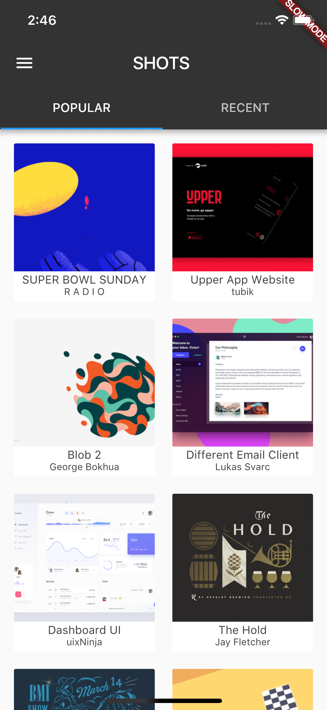
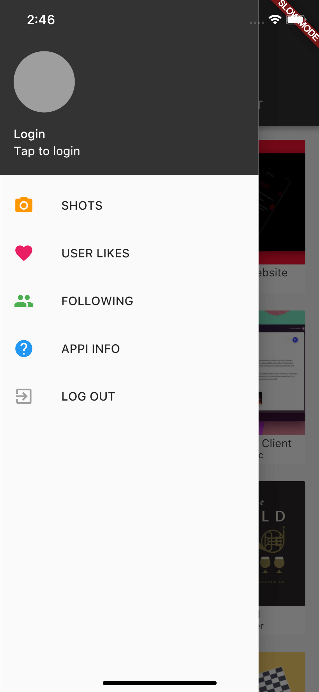
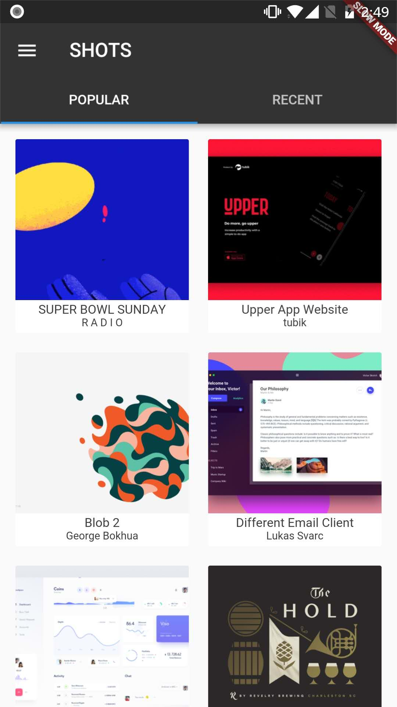
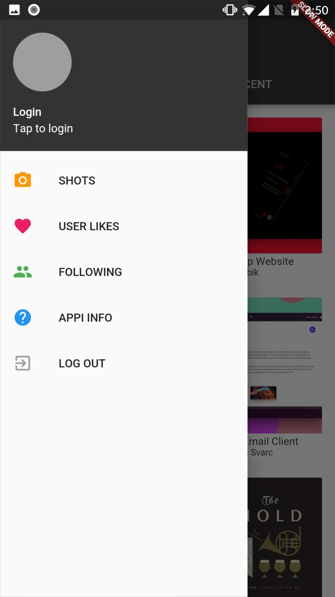

# flutter_drib (Dribbble in flutter)

Unofficial dribbble client in flutter. Runs in both android and iOS.

## Features
- [x] Popular/recent shots
- [ ] Shot detail
- [ ] About
- [ ] User likes
- [ ] Login

## Screenshots

### iOS
| Popular/Recent | Drawer |
| :-------------: | :-------------: |
|||

### Android
| Popular/Recent | Drawer |
| :-------------: | :-------------: |
|||


## Structure
Almost all codes are under `lib` directory.

directory | description
:--: | :--
api | Classes to load data from dribbble.
model | Model classes to parse json from api.
ui | Pages and components.
keys.dart | Dribbble keys are defined here. You can replace yours here(or keep mine).
main.dart | Entry for this app.

## Building

### Requirements
- Flutter environment, check flutter.io.

### Replace dribble keys(optional)
To build this project, you need to add your dribbble application keys first.

Keys are defined in `keys.dart` file in `lib/` directory. You need to define two constants:
```dart
const String CLIENT_ID = "your dribbble client id";
const String CLIENT_SECRET = "your dribbble client secret";
```
You can create your application [here](https://dribbble.com/account/applications/new).

### Run
Run `flutter run` in console to start this app.


##Thanks
